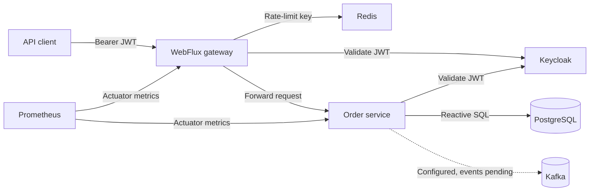
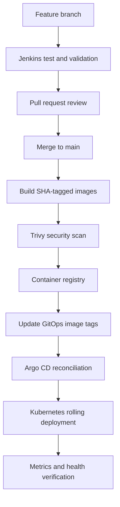

# Production Delivery Platform

A practical DevOps portfolio project for delivering Java 21 Spring WebFlux microservices with Docker, Jenkins, Helm, Kubernetes, Argo CD, Keycloak, Redis, PostgreSQL, Kafka, and Prometheus-compatible metrics.

> Current state: foundation branch. The application, local stack, security controls, container builds, Helm resources, Argo CD application, Jenkins quality gates, and automated test scripts are implemented. Kafka event publishing, automatic GitOps repository updates, Grafana dashboards, Loki collection, TLS ingress, and external secret management are documented next steps, not finished features.

## Architecture summary



The gateway is the public application entry point. It authenticates requests and applies per-principal Redis rate limiting. The order service validates the token again, derives ownership from the JWT subject, validates input, and accesses PostgreSQL through R2DBC.

Read the complete design in [System architecture](docs/ARCHITECTURE.md).

## What is implemented

| Area | Implementation |
| --- | --- |
| Application | Java 21, Spring Boot, WebFlux gateway, reactive order API |
| Authentication | OAuth2 resource servers using Keycloak-issued JWTs |
| Authorization | `orders.read` and `orders.write` scopes |
| Data isolation | Orders are queried by the authenticated JWT subject |
| Rate limiting | Redis-backed principal key at the gateway |
| Persistence | PostgreSQL, R2DBC, Flyway migration, indexed order table |
| Containers | Multi-stage Maven builds and non-root Java runtime images |
| Local environment | Docker Compose with PostgreSQL, Redis, Kafka, Keycloak, gateway, and order service |
| Kubernetes | Deployments, Services, probes, resources, HPA, PDB, topology spread, and restricted security context |
| GitOps | Argo CD Application with automated sync, pruning, self-healing, and retry |
| CI | Jenkins test, image build, Trivy scan, registry push, and Helm validation stages |
| Metrics | Spring Actuator Prometheus endpoints and a `ServiceMonitor` |
| Verification | Unit tests, configuration checks, and an authenticated end-to-end smoke test |

## Repository structure

```text
.
├── gateway-service/              Reactive API gateway and rate limiting
├── order-service/                Secured reactive order API and persistence
├── infra/keycloak/               Local realm, client, scopes, and demo users
├── deploy/helm/platform/         Kubernetes Helm chart
├── deploy/argocd/                Argo CD Application manifest
├── scripts/                      Verification and smoke-test automation
├── docs/                         Architecture and operating documentation
├── docker-compose.yml            Complete local runtime topology
├── Jenkinsfile                   Continuous delivery pipeline
└── pom.xml                       Java 21 multi-module Maven build
```

## Quick start

Required tools:

- Java 21
- Maven 3.9 or newer
- Docker with Compose v2
- Helm 3
- Git
- `curl` and Python 3 for the smoke test

Clone and select the foundation branch:

```bash
git clone https://github.com/Dapravith/production-delivery-platform.git
cd production-delivery-platform
git switch feat/production-ready-foundation
```

Run all build and manifest checks:

```bash
./scripts/verify.sh
```

Run the complete local smoke test:

```bash
./scripts/smoke-test.sh
```

The smoke test builds the images, starts the complete Compose stack, obtains Keycloak tokens, and verifies:

- Anonymous requests return `401`
- Invalid order amounts return `400`
- A valid order can be created and retrieved
- One authenticated customer cannot read another customer's orders

The stack is stopped after the test. Use `SMOKE_KEEP_RUNNING=true ./scripts/smoke-test.sh` to leave it running for inspection.

## Documentation map

| Document | Purpose |
| --- | --- |
| [System architecture](docs/ARCHITECTURE.md) | Components, request paths, trust boundaries, scaling, and data flow |
| [Implementation guide](docs/IMPLEMENTATION_GUIDE.md) | Step-by-step path from local development to Kubernetes |
| [CI/CD and GitOps](docs/CI_CD_GITOPS.md) | Jenkins stages, immutable images, Helm, Argo CD, promotion, and rollback |
| [Security guide](docs/SECURITY.md) | Authentication, authorization, secrets, containers, and production gaps |
| [Observability guide](docs/OBSERVABILITY.md) | Metrics, logs, dashboards, alerts, and recommended SLOs |
| [Testing guide](docs/TESTING.md) | Test layers, commands, acceptance criteria, and evidence collection |
| [Operations runbook](docs/OPERATIONS_RUNBOOK.md) | Deployment checks, diagnosis, rollback, and incident response |
| [Roadmap](docs/ROADMAP.md) | Twelve-week DevOps learning and implementation sequence |
| [Verification record](docs/VERIFICATION.md) | Checks completed and checks required before merging |

## Delivery overview



The Jenkinsfile currently stops at a documented placeholder for updating a separate GitOps repository. Complete that stage before claiming fully automatic delivery.

## Local development credentials

The imported Keycloak realm contains development-only users and passwords used by the smoke test. They are intentionally visible and must never be reused in shared, staging, or production environments.

## Production readiness boundary

This repository demonstrates production-oriented patterns, but it is not ready for sensitive production traffic without the following work:

- Replace example registry, identity, and GitOps repository values
- Add TLS ingress and controlled public routing
- Store secrets in an external secret manager
- Use highly available managed PostgreSQL, Redis, Kafka, and Keycloak services
- Implement Kafka domain events with an outbox or CDC pattern
- Complete automatic GitOps image promotion
- Deploy Grafana and Loki and add alert routing
- Add OpenTelemetry tracing and correlation IDs
- Add Kubernetes NetworkPolicies and image signature verification
- Test backups, restores, disaster recovery, and rollback procedures
- Run dependency, image, API, load, and resilience tests in CI

Do not describe the platform as production-ready until the acceptance gates in [Testing](docs/TESTING.md) pass in the target environment.
