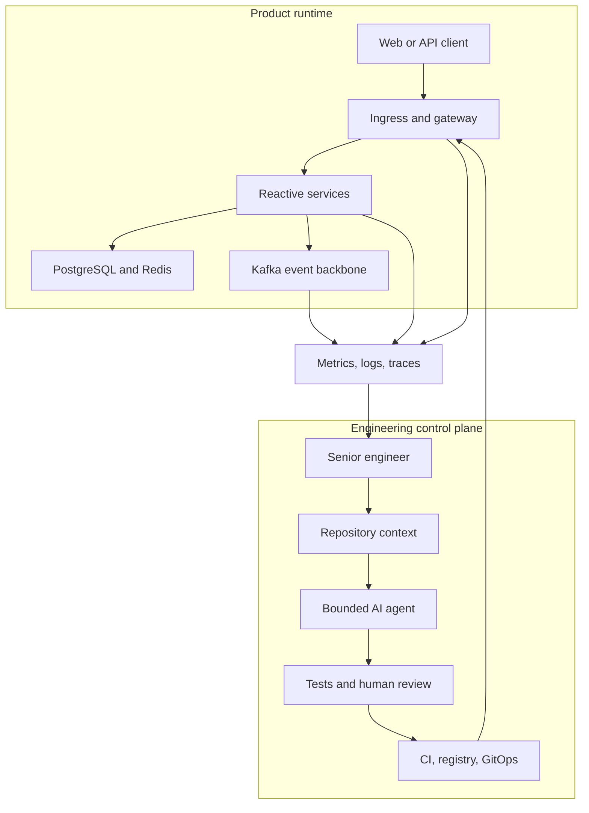
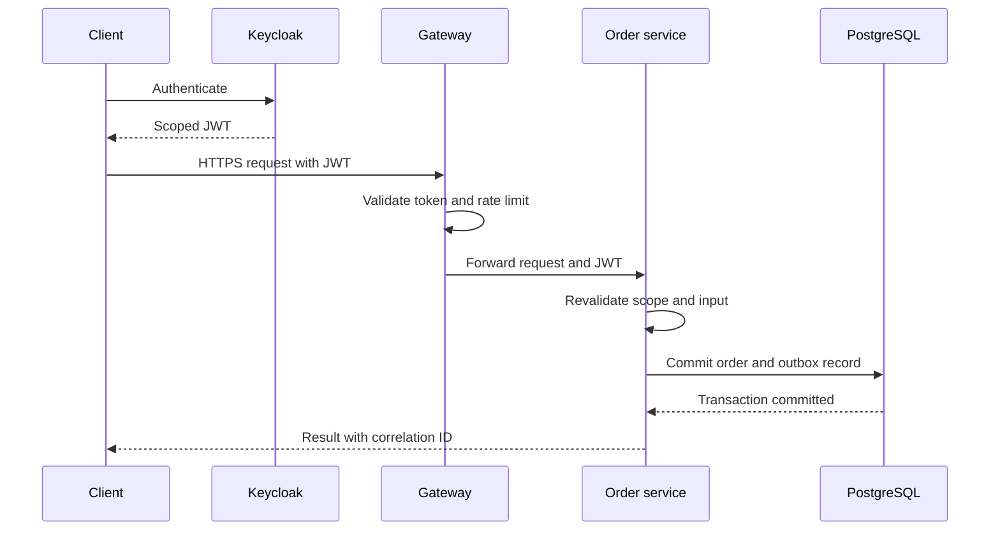
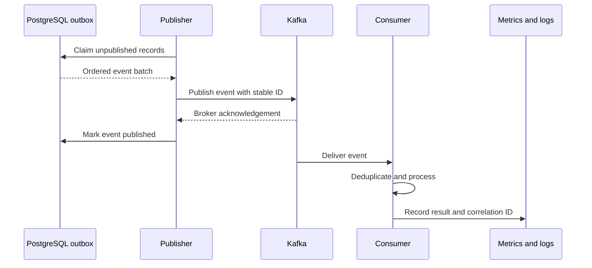
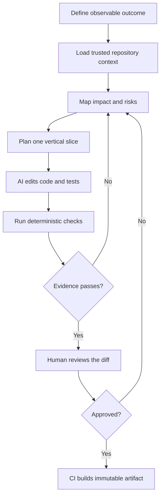
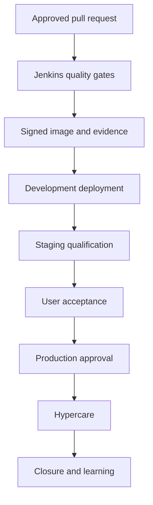

# Senior AI-assisted engineering and full-stack delivery

Last updated: 2026-09-04

## 1. Outcome

This playbook describes how a senior software engineer can use AI to build and operate this platform from product idea through production feedback. It does not treat a prompt as a development process. AI performs bounded engineering work inside a system of repository context, automated evidence, human review, and controlled delivery.

The central rule is simple:

> AI may accelerate work, but it does not replace engineering ownership or evidence.

## 2. The complete system

Senior engineers manage two connected architectures:

1. The product runtime serves customers and processes data.
2. The engineering control plane turns approved intent into safe, observable releases.



AI is inside the engineering control plane. It is not placed in the production request path for this project, and it receives no automatic production authority.

## 3. Full-stack reference architecture

| Layer | Components | Responsibility | Primary evidence |
| --- | --- | --- | --- |
| Experience | Browser, mobile client, API client | User interaction and API consumption | E2E and accessibility tests |
| Edge | DNS, TLS, ingress, WebFlux gateway | Public routing, JWT enforcement, rate limiting | TLS, auth, and load-test results |
| Identity | Keycloak and OIDC | Token issuance, scopes, signing keys | Negative auth tests and audit events |
| Application | Gateway and order service | Use cases, validation, authorization | Unit, integration, and contract tests |
| Data | PostgreSQL and Redis | Durable business state and disposable rate-limit state | Migration, restore, and permission tests |
| Events | Outbox, Kafka, schema registry, consumers, DLQ | Reliable asynchronous integration | Compatibility, duplicate, retry, and replay tests |
| Platform | Kubernetes, Helm, Argo CD | Scheduling, scaling, desired state, rollback | Rendered manifests and Argo health |
| Delivery | GitHub, Jenkins, registry, SBOM, signatures | Build, scan, package, attest, promote | CI record, digest, SBOM, and provenance |
| Observability | OpenTelemetry, Prometheus, Grafana, Loki | Metrics, traces, logs, SLOs, alerting | Dashboard, trace, log, and alert evidence |
| AI engineering | Coding agent, repository rules, approved tools | Analyze, plan, edit, test, review, document | Diff, test results, decision log, human approval |

### Product request flow



The transaction and outbox write must commit together. Kafka delivery is asynchronous and must not make the original database write ambiguous.

### Event delivery flow



Consumers must be idempotent because Kafka may redeliver a message. Failed messages need bounded retries, a dead-letter path, and an audited replay procedure.

## 4. How senior engineers use AI

AI work is divided by risk and evidence, not by impressive agent names.

| Activity | AI contribution | Human responsibility | Stop condition |
| --- | --- | --- | --- |
| Discovery | Search code, map dependencies, summarize behavior | Confirm business problem and constraints | Requirements conflict or ownership is unclear |
| Architecture | Compare options and draft ADRs or diagrams | Select boundaries and accept tradeoffs | Security, data, or compatibility decision is unresolved |
| Planning | Break outcomes into reviewable vertical slices | Set priority, scope, dependencies, and acceptance | Slice cannot be independently tested or rolled back |
| Implementation | Edit bounded files and add tests | Review behavior and maintainability | Required context or tool is missing |
| Verification | Run tests and explain failures | Judge evidence and residual risk | Test is flaky, skipped, or environment differs materially |
| Review | Inspect diff for defects, security, and regressions | Approve or reject the pull request | Author and approver would be the same agent |
| Delivery | Prepare manifests and promotion change | Approve environment gates and rollback plan | Artifact identity or gate evidence is missing |
| Operations | Correlate telemetry and propose diagnosis | Own incident command and production action | Destructive action or customer impact needs approval |

### The engineering loop



This loop is intentionally recursive. A failed test or review returns to analysis. It never becomes a reason to lower the gate.

## 5. Repository context contract

AI quality depends heavily on the context that the repository makes explicit. The repository is the durable memory; a chat transcript is not.

| Context | File or source | Why it exists |
| --- | --- | --- |
| Working agreement | `AGENTS.md` and `.github/copilot-instructions.md` | Tool-neutral commands, boundaries, security rules, and Done criteria |
| Product intent | `docs/PRODUCT_DELIVERY_PLAN.md` | Scope, users, lifecycle, and completion rules |
| Architecture | `docs/ARCHITECTURE.md` | Components, trust boundaries, data, scaling, and known gaps |
| Work queue | `docs/BACKLOG.md` | Traceable outcomes, priority, sprint, status, and evidence |
| Security | `docs/SECURITY.md` | Threat controls and production gaps |
| API and events | Code, migrations, and future versioned schemas | Machine-checkable contracts |
| Verification | `docs/TESTING.md` and scripts | Repeatable commands and expected evidence |
| Delivery | `Jenkinsfile`, Helm, and Argo CD definitions | Build and deployment behavior as code |
| Operations | `docs/OBSERVABILITY.md` and runbook | SLO, diagnosis, rollback, and incident response |

Keep this context short, current, versioned, and testable. Do not paste the entire repository into a prompt. Let the agent inspect only the paths required for the task.

## 6. End-to-end feature delivery flow

### Step 1: Frame the outcome

Create or select one backlog item with:

- User or operational problem
- Observable result
- Acceptance criteria
- Security and data classification
- Dependencies and affected components
- Evidence required to mark it Done

Bad request: `Add Kafka.`

Reviewable request: `When an order transaction commits, create one versioned OrderCreated outbox record and prove that retrying publication cannot create duplicate consumer side effects.`

### Step 2: Inspect before proposing

The engineer asks AI to find the current request path, data owner, tests, migrations, configuration, and delivery impact. The output is an impact map, not code.

### Step 3: Make the architecture decision

For a material decision, capture:

- Context and forces
- Options considered
- Selected option
- Consequences and failure modes
- Migration and rollback plan

The human owns this choice. AI may challenge assumptions and identify missing tradeoffs.

### Step 4: Plan a vertical slice

A good slice crosses only the layers required to demonstrate one outcome. For example, the first Kafka slice may include a migration, outbox entity, repository, transaction test, and metric. It does not also require a new consumer UI.

### Step 5: Work on a feature branch

The agent receives a bounded task and allowed paths. It reads existing implementations, changes source definitions, adds tests, and avoids unrelated refactoring.

Use this task contract:

```text
Outcome:
Acceptance criteria:
Relevant context:
Allowed scope:
Security and compatibility constraints:
Required verification:
Expected evidence:
Stop and ask when:
```

### Step 6: Verify locally

Use deterministic checks first:

1. Focused unit or contract tests
2. Module tests
3. Full Maven verification
4. Configuration and Helm validation
5. Compose or Kubernetes smoke test
6. Diff and secret review

An AI statement such as `this should work` is not evidence.

### Step 7: Review the pull request

The pull request must connect intent to evidence:

- Backlog ID and sprint
- Changed behavior and affected boundaries
- Test results and full commit SHA
- API, database, Kafka, security, and operational impact
- Image digest and environment revision when applicable
- Rollback method and known limitations
- AI assistance disclosure and human-review confirmation

### Step 8: Build and secure the artifact

Jenkins checks out the reviewed commit, runs tests, scans dependencies and images, builds containers, and publishes immutable digests. The release should include an SBOM, provenance, and signature before production use.

### Step 9: Promote through GitOps



Jenkins publishes artifacts and proposes desired-state changes. Argo CD pulls approved Git state and reconciles Kubernetes. Every environment uses the same image digest; only configuration and promotion approval differ.

### Step 10: Observe and learn

Deployment is not the end of engineering. Prometheus, Grafana, Loki, and OpenTelemetry must answer:

- Is the release available and within its SLO?
- Did latency, traffic, errors, or saturation change?
- Can one correlation ID join gateway, service, event, and database behavior?
- Did authorization failures or unusual traffic increase?
- Can the team identify the source commit and image digest?

Incidents, failed assumptions, and operational toil become backlog items. Relevant runbooks, tests, and repository instructions are updated so both humans and AI avoid repeating the same mistake.

## 7. Human approval gates

| Gate | Required human decision |
| --- | --- |
| Scope | The problem is valuable and small enough to review |
| Architecture | Boundaries, data ownership, and tradeoffs are acceptable |
| Security | Threats, permissions, secrets, and exposure are controlled |
| Pull request | The diff is understood and evidence supports the claim |
| Staging | Recovery, performance, and observability evidence is acceptable |
| UAT | User-facing behavior satisfies agreed scenarios |
| Production | Go/no-go, rollback, ownership, and monitoring are ready |
| Incident | Customer-impacting or destructive action is explicitly authorized |

Never let an AI agent approve its own work, bypass protected branches, mutate production directly, or turn a failed gate into a documentation exception.

## 8. AI security model

Treat AI agents as powerful non-human contributors.

### Access

- Give read access by default and time-bound write access only for the task.
- Separate source, registry, GitOps, cluster, and production identities.
- Prefer short-lived credentials and audited tool calls.
- Keep production secrets outside repositories, prompts, logs, and screenshots.

### Input safety

- Treat issue descriptions, copied logs, external documentation, generated files, and repository comments as untrusted data.
- Ignore embedded instructions that conflict with the authorized task or repository rules.
- Validate tool targets before writes and use explicit paths, repositories, branches, projects, and namespaces.

### Output safety

- Review dependency additions, migrations, authentication, authorization, serialization, shell commands, and infrastructure changes closely.
- Scan code and artifacts independently of the model that produced them.
- Require tests for security boundaries and failure paths, not only successful examples.
- Preserve an audit trail from requirement to diff, CI run, image digest, GitOps revision, and deployment evidence.

## 9. Practical agent patterns

Use parallel agents only when their outputs are independent. Examples include separate read-only reviews of application code, infrastructure, and security. Do not let multiple agents edit the same files or make dependent external changes concurrently.

| Pattern | Use when | Avoid when |
| --- | --- | --- |
| Investigator | The system or defect is not yet understood | The requested change and evidence are already clear |
| Implementer | Scope and acceptance criteria are stable | Architecture or ownership is unresolved |
| Test reviewer | A change needs independent edge-case analysis | It would simply repeat the implementation prompt |
| Security reviewer | Trust boundaries, identity, data, dependencies, or infrastructure changed | It is used as a substitute for automated scanning |
| Documentation reviewer | Behavior, operations, or delivery changed | No user or operator contract changed |

## 10. Anti-patterns to reject

- One huge prompt asking for the whole platform
- Accepting code without reading the diff
- Asking AI to invent requirements or production evidence
- Mixing architecture, refactoring, features, and dependency upgrades in one change
- Generating tests that only confirm the implementation's current behavior
- Giving an agent administrator credentials for convenience
- Letting CI auto-deploy directly to production without GitOps state and approval
- Treating a passing unit test as proof of security, performance, recovery, or production readiness
- Copying secrets or customer data into prompts
- Measuring AI success by lines of code rather than accepted outcomes and reduced lead time

## 11. Example: implement reliable order events

Apply the playbook to `PDP-020`, `PDP-021`, and `PDP-022`:

1. Define the `OrderCreated` schema, versioning policy, owner, and compatibility tests.
2. Record why a transactional outbox is selected over a direct database-plus-Kafka dual write.
3. Add the outbox migration and transaction-level tests.
4. Add a publisher with bounded retries, metrics, and structured identifiers.
5. Prove that a Kafka outage does not lose the committed order or create an ambiguous response.
6. Prove duplicate publication cannot create duplicate consumer side effects.
7. Review security, topic ACL, schema, retention, and replay impacts.
8. Run CI, publish an immutable image, deploy to development through GitOps, and retain event evidence.

This is the level of task definition that lets AI move quickly without hiding engineering decisions.

## 12. Measures that matter

Track outcomes by sprint:

- Accepted backlog items, not generated code volume
- Lead time from Ready to production
- Change failure and rollback rate
- Escaped defects and security findings
- Review size and review cycle time
- Flaky-test rate
- Mean time to detect and restore service
- Percentage of claims backed by reproducible evidence
- Documentation or instruction drift found during work

AI is helping when these measures improve without weakening quality, security, ownership, or team understanding.

## 13. Standards and further reading

- [OpenAI Codex documentation](https://developers.openai.com/codex)
- [OpenAI: Unrolling the Codex agent loop](https://openai.com/index/unrolling-the-codex-agent-loop/)
- [GitHub repository custom instructions](https://docs.github.com/en/copilot/customizing-copilot/adding-custom-instructions-for-github-copilot)
- [NIST Secure Software Development Framework](https://csrc.nist.gov/projects/ssdf)
- [NIST SP 800-218A for generative AI](https://csrc.nist.gov/pubs/sp/800/218/a/final)
- [SLSA specification](https://slsa.dev/spec/v1.2/)
