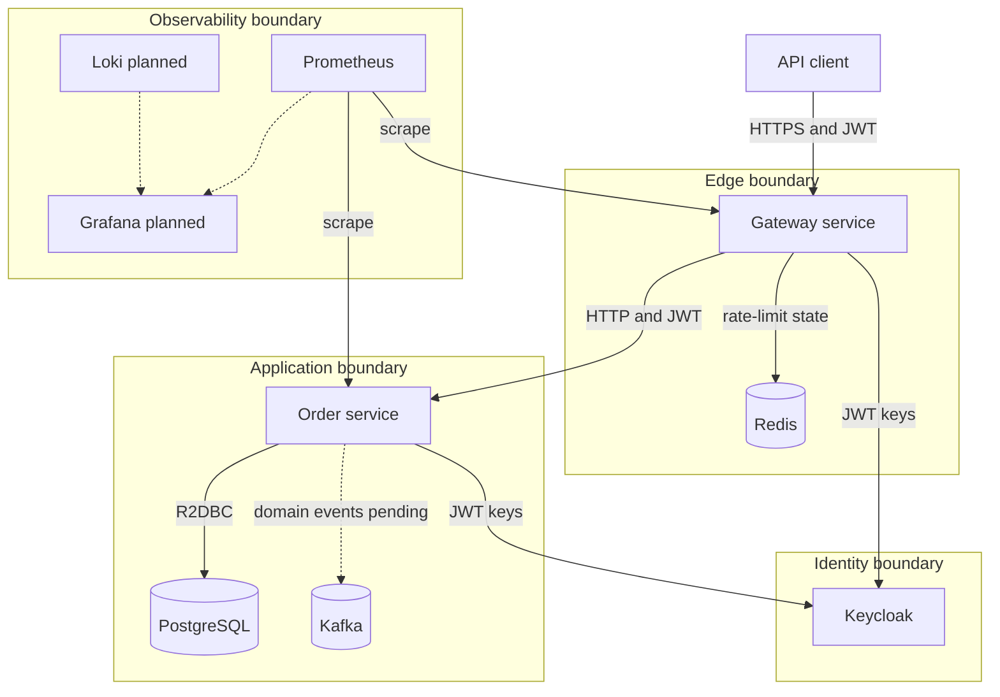
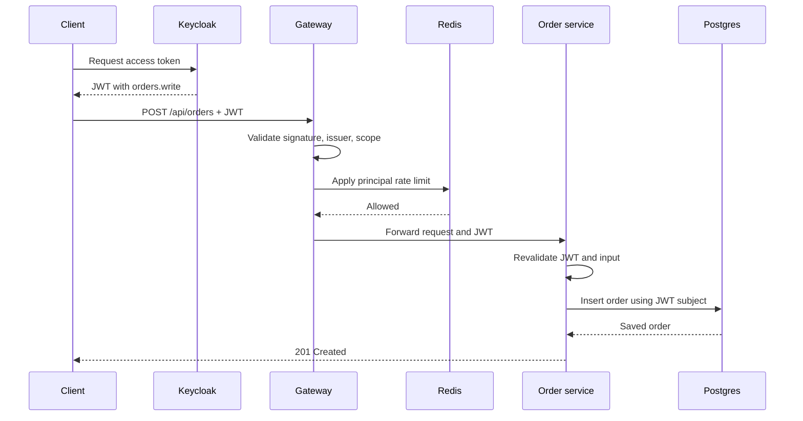
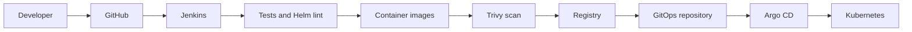

# System architecture

## 1. Purpose

The Production Delivery Platform demonstrates how a team can build, secure, test, package, deploy, scale, and observe reactive Java microservices. It is intentionally small enough for one developer to operate, but its boundaries match real delivery systems.

The example business workload contains two services:

- `gateway-service`: external entry point, JWT validation, routing, and Redis-backed rate limiting
- `order-service`: authenticated order creation and retrieval, validation, customer isolation, reactive PostgreSQL persistence, and metrics

## 2. Runtime context

Solid lines represent implemented application paths. Dotted lines represent planned or only partially configured paths.

## 3. Request lifecycle

### Create an order

Security is enforced twice. The gateway protects the edge, while the order service remains independently protected if internal routing is misconfigured or bypassed.

### Read orders

The order service never accepts a customer identifier from the query to decide ownership. It obtains the subject from the verified JWT and calls `findAllByCustomerIdOrderByCreatedAtDesc(subject)`. This prevents a caller from changing a URL parameter to view another customer's records.

## 4. Component responsibilities

| Component | Responsibility | Scaling model | Failure effect |
| --- | --- | --- | --- |
| Gateway | Authentication, routing, rate limiting | Stateless replicas; shared Redis state | External API unavailable if all replicas fail |
| Redis | Distributed rate-limit counters | Managed/replicated in production | Rate limiting may fail and gateway health can degrade |
| Order service | Authorization, validation, order use cases | Stateless replicas | Order operations unavailable if all replicas fail |
| PostgreSQL | Durable order data | Managed HA primary and replicas recommended | Writes and reads fail if unavailable |
| Keycloak | Token issuance and signing keys | Multiple replicas and external database recommended | New logins fail; cached keys may still validate existing tokens temporarily |
| Kafka | Future asynchronous domain events | Multi-broker cluster in production | No business effect yet because publishing is not implemented |
| Prometheus | Metrics collection | Platform-managed | Application continues, but operational visibility is reduced |
| Argo CD | Desired-state reconciliation | HA installation recommended | Running workloads continue; automated changes pause |
| Jenkins | Build and release orchestration | Durable controller and disposable agents | New releases pause; deployed applications continue |

## 5. Data architecture

The `orders` table is created by Flyway migration `V1__create_orders.sql`.

| Column | Type | Rule |
| --- | --- | --- |
| `id` | UUID | Primary key generated by the service |
| `customer_id` | VARCHAR | JWT subject; required |
| `amount` | NUMERIC(19,2) | Greater than zero |
| `currency` | VARCHAR(3) | Required; `USD` or `KHR` |
| `status` | VARCHAR(32) | Required lifecycle value |
| `created_at` | TIMESTAMPTZ | UTC-capable creation timestamp |

Flyway uses a migration identity that may create and alter schema objects. The reactive application uses a separate runtime identity with data access to `orders` and no schema-creation permission.

The composite index on `(customer_id, created_at DESC)` supports the main read pattern without scanning every customer's data.

## 6. Kubernetes architecture

Each service receives:

- A Deployment with a rolling update strategy
- A stable ClusterIP Service
- Liveness and readiness probes
- CPU and memory requests and limits
- A HorizontalPodAutoscaler targeting 70% CPU
- A PodDisruptionBudget with at least one available pod
- Topology spread across nodes when possible
- A non-root pod and restricted container security context
- A writable `emptyDir` mounted only at `/tmp`
- No mounted service-account token because the applications do not call the Kubernetes API

The chart expects external PostgreSQL, Redis, Kafka, Keycloak, and database Secret resources. Those stateful systems are deliberately excluded from the application chart because their lifecycle and recovery requirements differ from stateless services.

## 7. Delivery architecture

Images use the first 12 characters of the Git commit SHA. This creates a traceable link between source, image, and deployment. Production tags must remain immutable.

The current Jenkins `Update GitOps` stage is a placeholder. A production implementation must update only the image tags in the environment repository, commit the change using a dedicated bot identity, and let Argo CD reconcile it.

## 8. Trust boundaries

| Boundary | Required protection |
| --- | --- |
| Internet to gateway | TLS, WAF or ingress controls, JWT, rate limiting |
| Gateway to services | NetworkPolicy, JWT forwarding, optional service mesh mTLS |
| Service to database | Private network, least-privilege database user, TLS |
| Service to Kafka | TLS/SASL, topic ACLs, schema compatibility |
| Jenkins to registry | Short-lived credential, scoped push permission |
| Argo CD to Git | Read-only deploy key where possible |
| Prometheus to services | Cluster-only metrics exposure and NetworkPolicy |

## 9. Availability and scaling

The two default replicas, HPA, PDB, rolling strategy, and topology spread protect against routine pod and node maintenance. They do not create full high availability on a single-node cluster. Production availability depends on multi-node scheduling and highly available dependencies.

Reactive programming improves concurrency for I/O-bound workloads but does not remove capacity limits. Load tests must determine connection-pool sizes, CPU requests, rate limits, and replica boundaries.

## 10. Known architecture gaps

- No transactional outbox or Kafka producer/consumer implementation
- No schema registry or event contract
- No ingress, certificate automation, or DNS configuration
- No external secret operator
- No Kubernetes NetworkPolicy
- No OpenTelemetry tracing
- No deployed Grafana dashboards or Loki pipeline
- No automated GitOps commit in Jenkins
- No backup or disaster-recovery automation
- No multi-environment promotion policy

These gaps are deliberate and tracked in the implementation and roadmap documents.
