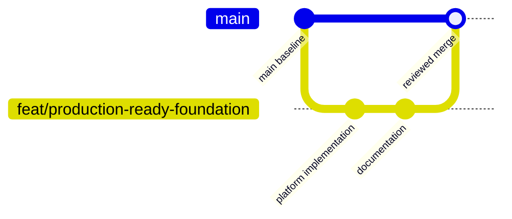

# CI/CD and GitOps guide

## 1. Delivery principles

The project separates three responsibilities:

- Continuous integration proves that source and deployment definitions are valid.
- Image publishing produces immutable, traceable runtime artifacts.
- GitOps promotion changes the declared environment state and lets Argo CD reconcile it.

The deployment cluster should pull a specific image tag. It should never depend on a moving `latest` tag for production promotion.

## 2. Branch workflow



Recommended policy:

1. Create a focused feature branch.
2. Require Jenkins verification on pull requests.
3. Require at least one review for production changes.
4. Merge only when required checks pass.
5. Build and publish images from the trusted `main` commit.
6. Promote that immutable tag through the GitOps repository.

## 3. Jenkins stages

| Stage | Purpose | Failure response |
| --- | --- | --- |
| Checkout | Retrieve exact source and calculate SHA tag | Stop; repository or credential issue |
| Test | Compile and execute Maven tests | Fix code or tests; never skip |
| Build images | Produce gateway and order images | Inspect Docker context and dependency download |
| Security scan | Block critical known vulnerabilities | Upgrade or document a time-bound exception |
| Push | Publish images from `main` | Check registry credentials and network |
| Validate Helm | Lint and render the chart | Fix templates or values |
| Update GitOps | Promote image tags | Currently a placeholder; implement before automation claim |

## 4. Required Jenkins configuration

Create a Linux agent label with Java 21, Maven, Docker, Helm, Trivy, and Git. Prefer disposable agents with no long-lived application secrets.

Required credential:

| ID | Type | Minimum permission |
| --- | --- | --- |
| `container-registry` | Username/password or token binding | Push only to the two application repositories |

Recommended future credentials:

| ID | Type | Minimum permission |
| --- | --- | --- |
| `gitops-deploy-key` | SSH private key | Write only to the environment values repository |

## 5. Implementing the GitOps update

Use a separate environment repository such as:

```text
environments/
├── development/platform-values.yaml
├── staging/platform-values.yaml
└── production/platform-values.yaml
```

The Jenkins step should:

1. Clone the environment repository using a bot identity.
2. Update only `gateway.tag` and `order.tag`.
3. Validate the resulting Helm render.
4. Commit with the source commit SHA in the message.
5. Push directly for development or open a reviewed promotion pull request for production.

Do not let Jenkins call `kubectl apply` for normal production delivery. Argo CD should own reconciliation so Git remains the audit trail.

## 6. Argo CD behavior

The Application enables:

- `prune`: remove resources deleted from desired state
- `selfHeal`: reverse manual drift
- `CreateNamespace=true`: create the target namespace when missing
- Retry with backoff: recover from temporary API or dependency failures

Before production, restrict the Argo CD AppProject to approved repositories, namespaces, clusters, and resource kinds.

## 7. Promotion model

| Environment | Trigger | Approval | Tag rule |
| --- | --- | --- | --- |
| Development | Merge to `main` | Automated | Git SHA |
| Staging | Promotion pull request | Team review | Same SHA tested in development |
| Production | Approved promotion PR | Change approval | Same SHA tested in staging |

Rebuilding an image for each environment breaks artifact integrity. Promote the same image digest instead.

## 8. Rollback

Preferred rollback is a Git revert in the GitOps repository:

```bash
git revert <bad-promotion-commit>
git push
```

Argo CD then reconciles the previous tag. Emergency rollback with `kubectl rollout undo` can restore service quickly, but self-heal may reapply the Git state. Follow the emergency action with a Git revert immediately.

## 9. Supply-chain improvements

Add these gates before production:

- Dependency and secret scanning
- Software bill of materials generation
- Image signing with keyless workload identity
- Admission verification of signatures and trusted registries
- Pinned base-image digests
- Provenance attestation linking source, build, and image digest
- Protected branches and required CI checks
