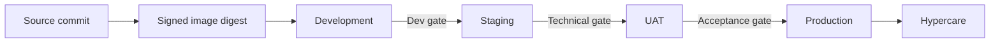

# Environment promotion plan

## 1. Promotion principle

Build an image once, record its digest, and promote the same artifact through development, staging, UAT, and production. Environment changes happen through reviewed Git commits reconciled by Argo CD.

## 2. Development gate

- Maven and smoke tests pass
- Helm lint and render pass
- Images have immutable digests
- Argo CD reports Synced and Healthy
- Both application Prometheus targets are UP
- Authenticated create/read flow succeeds
- No critical vulnerability is unapproved

## 3. Staging gate

- Uses production-like Kubernetes and dependency versions
- TLS, NetworkPolicies, and external secrets work
- Database migration succeeds on staging data
- Functional, security, load, and resilience suites pass
- Dashboards, logs, traces, and alerts work
- Backup restore and rollback are demonstrated
- Runbook is usable by someone other than the implementer

## 4. UAT gate

- UAT scope and representative users are approved
- Test data contains no unapproved personal or production data
- Critical business scenarios pass
- Open defects have severity, owner, and disposition
- Required stakeholders approve the release candidate
- No code or image rebuild occurs after UAT without retesting

## 5. Production go/no-go gate

| Check | Owner | Evidence | Result |
| --- | --- | --- | --- |
| Approved commit and image digest | Release owner | Git and registry | Pending |
| UAT accepted | Product owner | UAT record | Pending |
| Security gate passed | Security reviewer | Scan and review | Pending |
| Database backup confirmed | Database owner | Backup ID and restore test | Pending |
| Rollback prepared | Operations | Tested previous digest | Pending |
| Monitoring and alerts active | Operations | Target and alert tests | Pending |
| Change window confirmed | Release owner | Release record | Pending |
| Incident contacts available | Operations | Contact matrix | Pending |

Any P0 failure produces a no-go decision.

## 6. Production release sequence

1. Freeze release candidate changes.
2. Record source commit and image digests.
3. Confirm backup and rollback revision.
4. Approve the production GitOps change.
5. Merge the production promotion.
6. Watch Argo CD sync and Kubernetes rollout.
7. Run production-safe smoke checks.
8. Observe SLO indicators through the defined window.
9. Announce success or execute rollback.
10. Start hypercare.

## 7. Hypercare

For the first release, use one week:

- Review health, errors, latency, saturation, and alerts daily.
- Track all incidents and defects.
- Avoid unrelated changes.
- Keep the previous image digest ready.
- Close hypercare only when no critical incident remains and normal ownership accepts the service.

## 8. Rollback triggers

Rollback when:

- Availability or error-budget burn exceeds the approved threshold
- Data integrity is at risk
- Authentication or authorization is broken
- Critical user workflow fails
- Monitoring is unavailable and safe operation cannot be confirmed
- A critical vulnerability affects the released artifact

Document who can call rollback before the release starts.
