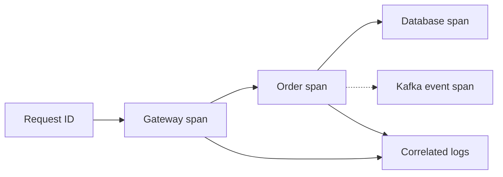

# Observability guide

## 1. Current implementation

Both services expose:

- `/actuator/health/liveness`
- `/actuator/health/readiness`
- `/actuator/prometheus`

The Helm chart creates one `ServiceMonitor` that selects both application Services. Micrometer attaches an `application` tag so queries can separate gateway and order metrics.

The repository does not currently deploy Prometheus, Grafana, Loki, Grafana Alloy, or an alert manager. Install them as platform services and treat them as shared infrastructure.

## 2. Four golden signals

| Signal | Meaning | Example source |
| --- | --- | --- |
| Traffic | Request volume | HTTP server request count/rate |
| Errors | Failed request ratio | HTTP 5xx request rate |
| Latency | Response duration | HTTP request duration histogram |
| Saturation | Resource pressure | CPU, memory, connection pools, queue lag |

## 3. Suggested Prometheus queries

Metric names can vary with Micrometer and Prometheus versions. Confirm actual names at `/actuator/prometheus` before saving dashboards.

Request rate by application:

```promql
sum by (application) (rate(http_server_requests_seconds_count[5m]))
```

Server error ratio:

```promql
sum(rate(http_server_requests_seconds_count{status=~"5.."}[5m]))
/
sum(rate(http_server_requests_seconds_count[5m]))
```

95th percentile latency when histogram buckets are enabled:

```promql
histogram_quantile(
  0.95,
  sum by (le, application) (rate(http_server_requests_seconds_bucket[5m]))
)
```

Pod CPU usage against requested CPU requires kube-state-metrics and container metrics. Build that panel in the shared Kubernetes monitoring stack.

## 4. Recommended dashboards

### Service overview

- Request rate by service and route
- P50, P95, and P99 latency
- 4xx and 5xx ratios
- Active replicas and unavailable replicas
- CPU and memory usage versus requests and limits
- Pod restart count

### Gateway

- Rate-limit rejections
- Downstream response latency
- Redis connection failures
- Authentication failures
- HTTP response distribution

### Order service

- Order creation rate
- Validation failure rate
- Database connection-pool utilization
- Database query latency
- Kafka publish and consumer metrics after events are implemented

### Delivery

- Jenkins success rate and duration
- Deployment frequency
- Argo CD sync and health status
- Rollout duration
- Change failure rate
- Mean time to recovery

## 5. Logs

Applications currently write container logs to stdout. A future Alloy deployment should:

1. Collect Kubernetes pod logs.
2. Add namespace, workload, pod, container, application, and environment labels.
3. Parse structured JSON.
4. Forward logs to Loki.
5. Avoid high-cardinality labels such as request IDs and user IDs.

Request or trace IDs belong in log fields and should be searched, not used as Loki labels.

## 6. Tracing

Add Micrometer Tracing and OpenTelemetry export to an OpenTelemetry Collector. Propagate W3C `traceparent` across gateway, order service, Kafka messages, and future services.

Desired correlation:



## 7. Initial SLO proposal

Do not adopt these values blindly. Confirm business expectations and measure a baseline first.

| Indicator | Starting objective |
| --- | --- |
| Gateway availability | 99.9% monthly |
| Order API successful-request availability | 99.9% monthly |
| Order API P95 latency | Under 500 ms |
| Critical alert acknowledgement | Under 15 minutes |
| Critical service recovery | Under 60 minutes |

## 8. Alert principles

Alerts should identify user impact and include an owner, severity, dashboard, and runbook.

Recommended first alerts:

- Availability or error-budget burn
- Sustained 5xx ratio
- P95 latency degradation
- No ready replicas
- Crash loop or repeated restarts
- PostgreSQL connection exhaustion
- Redis unavailable
- Argo CD application degraded or out of sync
- Jenkins release pipeline failure

Avoid alerting on every transient CPU spike. Use sustained windows and combine symptom alerts with diagnostic dashboards.

## 9. Verification checklist

- ServiceMonitor exists and has the Prometheus selector label
- Both Prometheus targets are `UP`
- Dashboard filters by environment and application
- A test 500 response appears in metrics and logs
- A correlation ID can locate one request across services
- Test alerts route to a non-production notification channel
- Every actionable alert links to a runbook
