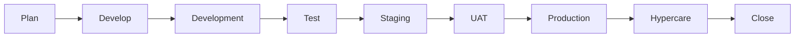

# Product delivery plan

## 1. Product objective

Build and prove a reusable delivery platform for secured Java Spring WebFlux microservices. The completed product must demonstrate a controlled path from source code to development, staging, user acceptance testing, production, hypercare, and formal project closure.

The project is successful when another developer can clone the repository, follow the documentation, reproduce the environment, deploy the services, observe them, recover a failed release, and verify the result from stored evidence.

## 2. Delivery model

- Cadence: one-week personal sprints
- Sprint window: Monday through Sunday
- Planning: Monday
- Daily update: five minutes each working day
- Implementation and verification: Tuesday through Friday
- Review and retrospective: Saturday
- Buffer and learning: Sunday
- Source of truth: GitHub branch, issues, pull requests, and repository progress files

## 3. Lifecycle

A stage cannot advance because a date was reached. It advances only when the exit gate has evidence.

## 4. Stage gates

| Stage | Required output | Exit criteria | Evidence |
| --- | --- | --- | --- |
| Plan | Scope, architecture, backlog, risks, sprint schedule | Documents reviewed and prioritized | Approved Markdown and tracking issue |
| Develop | Compiling services and deployment definitions | Unit tests and static checks pass | Maven report and commit SHA |
| Development | Running development environment | Authenticated API works through gateway | Smoke-test log and environment revision |
| Test | Functional, security, load, and resilience results | No open release-blocking defects | Test summary and defect report |
| Staging | Production-like deployment | Health, observability, rollback, and data checks pass | Argo revision, dashboards, rollback result |
| UAT | User scenarios and sign-off | All critical scenarios accepted | UAT record and approved exceptions |
| Production | Controlled release | SLOs healthy and rollback available | Release record, image digests, metrics |
| Hypercare | Stabilization period | No unresolved critical incident | Daily health review and incident list |
| Close | Handover and retrospective | Owners accept operations and remaining backlog | Closure report and archived evidence |

## 5. Product scope

### Included

- Reactive Java gateway and order service
- Keycloak JWT authentication and authorization scopes
- Redis rate limiting
- PostgreSQL with R2DBC and Flyway
- Kafka event integration using a production-safe pattern
- Container build and vulnerability scanning
- Jenkins continuous integration and delivery
- Helm and Kubernetes deployment
- Argo CD GitOps reconciliation
- Prometheus, Grafana, Loki, and OpenTelemetry observability
- Automated functional, security, load, and resilience tests
- Development, staging, UAT, and production promotion
- Operations, incident response, rollback, handover, and closure

### Excluded from the first product release

- Customer-facing frontend
- Billing or payment processing
- Multi-region active-active deployment
- A custom internal developer portal
- Business features outside the order example

Excluded work can enter a later release only through backlog refinement and an explicit scope decision.

## 6. Environment strategy

| Environment | Purpose | Data | Promotion |
| --- | --- | --- | --- |
| Local | Fast developer feedback | Disposable synthetic data | Manual Compose start |
| Development | Integration and GitOps verification | Synthetic resettable data | Automatic from trusted `main` build |
| Staging | Production-like technical validation | Masked or synthetic data | Reviewed promotion PR |
| UAT | Stakeholder acceptance | Controlled representative data | Staging release candidate |
| Production | Real service operation | Protected production data | Approved production promotion PR |

Build once and promote the same image digest. Do not rebuild an image for each environment.

## 7. Release policy

A release candidate requires:

- Clean repository and traceable commit
- Successful Maven, configuration, Helm, and smoke tests
- No unapproved critical vulnerability
- Staging deployment healthy
- Rollback tested for the same release process
- UAT approval
- Production configuration reviewed
- Monitoring and alerts active
- Named release owner and rollback decision maker

## 8. Progress policy

Use these statuses consistently:

| Status | Meaning |
| --- | --- |
| Backlog | Valid work not assigned to a sprint |
| Ready | Meets Definition of Ready and can enter a sprint |
| In progress | Actively being implemented |
| Blocked | Cannot continue; blocker and owner recorded |
| In review | Implementation complete; evidence under review |
| Done | Definition of Done and stage gate satisfied |
| Deferred | Explicitly moved out of the current product release |

Progress is calculated from accepted backlog items, not hours spent.

## 9. Governance for a personal project

One person can perform development, but critical decisions still need separation where possible:

| Responsibility | Owner |
| --- | --- |
| Product scope and priority | Product owner: Dapravith |
| Development and automation | Developer/DevOps owner: Dapravith |
| Security review | Peer, mentor, or documented self-review checklist |
| UAT approval | Named representative user or reviewer |
| Production go/no-go | Product owner plus operational reviewer |

If no independent reviewer is available, record that limitation instead of claiming independent approval.

## 10. Completion definition

The project is closed only when:

- Production release and rollback have been demonstrated
- Required SLO dashboards and alerts are active
- No critical or high release-blocking defect remains
- Operational ownership and access are documented
- Backup and restore evidence exists
- Security and dependency risks are accepted or resolved
- Remaining enhancements are moved to a future backlog
- Final retrospective and closure report are committed

See [Project closure](PROJECT_CLOSURE.md) for the complete checklist.
