# Project progress

Last updated: 2026-09-04  
Active branch: `feat/production-ready-foundation`  
Current state: pre-sprint baseline complete; S01 planned

## Executive status

| Dimension | Status | Evidence or blocker |
| --- | --- | --- |
| Product plan | Done | Scope, lifecycle, stage gates, backlog, and sprint plan documented |
| Architecture | Done | Runtime, delivery, security, Kubernetes, and data architecture documented |
| Application foundation | In review | Code and static checks exist; Java 21 build evidence pending |
| Automated testing | In progress | Unit and smoke tests exist; execution evidence pending |
| CI/CD | In progress | Jenkins stages exist; registry and GitOps update need completion |
| Development deployment | Not started | Requires prepared Kubernetes environment |
| Staging | Not started | Depends on development gate |
| UAT | Not started | Depends on staging approval |
| Production | Not started | Depends on UAT and readiness review |
| Closure | Not started | Depends on production hypercare |

## Lifecycle progress

Accepted stages: 2 of 10  
Stage progress: 20%

This percentage counts accepted lifecycle stages equally. It does not claim that 20% of engineering effort is complete.

```mermaid
flowchart LR
    P[Plan: Done] --> A[Architecture: Done]
    A --> D[Develop: In review]
    D --> T[Test: In progress]
    T --> DEV[Development: Not started]
    DEV --> S[Staging: Not started]
    S --> U[UAT: Not started]
    U --> PR[Production: Not started]
    PR --> H[Hypercare: Not started]
    H --> C[Close: Not started]
```



## Backlog summary

| Status | Count |
| --- | ---: |
| Done | 4 |
| In progress | 3 |
| Ready | 4 |
| Backlog | 38 |
| Blocked | 0 |
| In review | 0 |
| Deferred | 0 |
| Total | 49 |

Counts must be updated whenever a backlog status changes.

## Current sprint

S01 begins 2026-09-07.

Goal: prove clean build, local runtime, Jenkins quality gates, and Helm rendering.

| Item | Status | Next action |
| --- | --- | --- |
| PDP-010 | In progress | Run Java 21 Maven verification |
| PDP-011 | In progress | Run Compose smoke test |
| PDP-030 | Ready | Configure a Jenkins agent and credentials |
| PDP-040 | In progress | Run Helm lint and resource-count checks |

## Current blockers

| Blocker | Impact | Owner | Resolution |
| --- | --- | --- | --- |
| Creation workspace lacks Java 21 build tools, Maven, Docker, and Helm | Runtime evidence cannot be produced in the creation workspace | Dapravith | Run S01 on local workstation or prepared Jenkins agent |
| Registry remains `registry.example.com` | Images cannot be published | Dapravith | Select registry and configure scoped credential |
| GitOps repository is an example URL | Argo CD cannot deploy real environment state | Dapravith | Create environment repository in S08 |

## Risks

| Risk | Probability | Impact | Response |
| --- | --- | --- | --- |
| Too much scope for one-week sprints | High | Medium | Split L items and protect sprint goal |
| Local stack differs from Kubernetes | Medium | High | Validate early in development cluster |
| Security controls remain demonstrations | Medium | High | Complete S02 and S08 gates before staging |
| Observability arrives too late | Medium | High | Connect Prometheus in S07 before staging |
| Stateful dependencies become operational burden | High | High | Prefer managed services or documented operators |
| Solo approval creates blind spots | High | Medium | Request peer review for security, UAT, and release |

## Decisions

| Date | Decision | Reason |
| --- | --- | --- |
| 2026-09-04 | Use one-week personal sprints | Maintain focus and produce weekly evidence |
| 2026-09-04 | Require evidence-based stage gates | Avoid treating planned dates as completion |
| 2026-09-04 | Track full lifecycle in repository and GitHub issues | Keep product, technical, and release work visible |
| 2026-09-04 | Preserve incomplete capabilities as explicit backlog | Prevent misleading production-readiness claims |

## Weekly update template

Copy this section at the end of each sprint:

```markdown
## S## review: YYYY-MM-DD

- Sprint goal: Achieved / Partial / Not achieved
- Planned items:
- Accepted items:
- Returned items:
- Blockers:
- Defects opened/closed:
- Evidence links:
- Release forecast change:
- One retrospective improvement:
```

## Next update

Update this file after the S01 review on 2026-09-12 or immediately after a material blocker or stage-gate decision.
