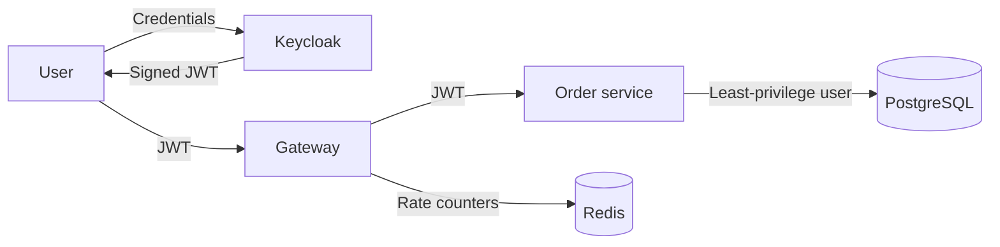
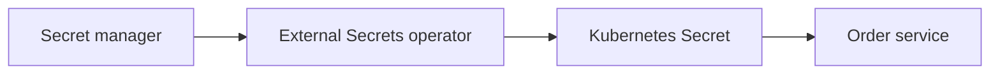

# Security guide

## 1. Security model

The platform assumes every network boundary can fail. The gateway validates access tokens, but the order service also validates them and enforces authorization independently.

## 2. Implemented controls

### Authentication

- Both services use Spring OAuth2 resource server support.
- JWT signature keys are loaded from the configured JWK Set URI.
- The issuer claim must equal the configured issuer.
- Health and Prometheus endpoints are the only unauthenticated application endpoints.

### Authorization

- `GET /api/orders` requires `SCOPE_orders.read`.
- `POST /api/orders` requires `SCOPE_orders.write`.
- Method security is enabled in the order service.

### Object ownership

The service obtains `customerId` from `Jwt.getSubject()`. It never trusts a client-provided customer identifier when saving or querying orders.

### Input protection

The order amount is required, must be between `0.01` and `1000000.00`, and may have at most two decimal places. Currency is required and restricted to uppercase `USD` or `KHR`. PostgreSQL enforces the positive amount, maximum amount, and supported currency rules again.

### Abuse protection

The gateway applies a Redis-backed rate limit per authenticated principal:

- Replenish rate: 20 requests per second
- Burst capacity: 40 requests

These are demonstration defaults. Set production limits from measured traffic and business requirements.

### Container controls

- Runtime images use an unprivileged `app` user.
- Kubernetes rejects privilege escalation.
- Linux capabilities are dropped.
- Root filesystems are read-only.
- `/tmp` is the only writable application mount.
- The default seccomp profile is enabled.
- Kubernetes service-account tokens are not mounted.

## 3. Local credentials

`infra/keycloak/platform-realm.json` contains development credentials so the smoke test can run without manual setup. These credentials are public and unsafe for any shared environment.

Production rules:

- Do not import the local demo users.
- Do not store passwords, client secrets, tokens, or private keys in Git.
- Use short-lived workload identity where supported.
- Rotate credentials immediately after suspected exposure.

## 4. Secrets architecture

The Helm chart references an existing Kubernetes Secret named `platform-database`; it does not create secret values. The Secret has separate `app-username`, `app-password`, `migrator-username`, and `migrator-password` entries. The application role performs runtime data operations. The migrator role owns schema changes and must not be used for normal requests.

Recommended production flow:

Use a dedicated database account with only the schema permissions required by the service. Consider a separate migration identity if organizational policy separates schema migration from runtime access.

## 5. Network policy requirements

Add default-deny ingress and egress policies, then allow only:

- Ingress controller to gateway
- Gateway to order service and Redis
- Order service to PostgreSQL, Kafka, and Keycloak JWK endpoint
- Prometheus to application metrics endpoints
- DNS from application pods

Metrics endpoints are unauthenticated by application design, so they must remain cluster-private and be protected by network controls.

## 6. Keycloak production requirements

- Use HTTPS and a stable public issuer URL.
- Run multiple Keycloak replicas with an external database.
- Disable direct password grants unless a specific trusted client requires them.
- Use authorization code with PKCE for browser and mobile clients.
- Keep access tokens short-lived and rotate signing keys safely.
- Review client scopes and audience claims.
- Apply brute-force protection and administrative audit logging.

The local `platform-cli` direct grant exists only for automated smoke testing.

## 7. Kafka security requirements

Kafka is locally provisioned without authentication. Production Kafka must use:

- TLS encryption
- SASL or workload identity
- Topic-level ACLs
- Schema compatibility rules
- Idempotent producers
- Consumer-side idempotency
- A transactional outbox or CDC-based publication design

No business event publishing exists yet, so Kafka security is a prerequisite for that implementation rather than an active application control.

## 8. Threat checklist

| Threat | Current mitigation | Remaining work |
| --- | --- | --- |
| Forged token | Signature, issuer, and intended-audience validation | Test key rotation and production identity configuration |
| Excessive requests | Redis rate limiting | Tune limits and add ingress protection |
| Cross-user data access | JWT subject ownership filter and authorization integration test | Add policy tests when more roles are introduced |
| Invalid amount or currency | Bean Validation, problem details, and database checks | Implemented; extend supported currencies only through an approved product decision |
| Container privilege | Non-root and restricted context | Admission policy enforcement |
| Secret leakage | Secret reference, no prod value in chart | External secret manager and secret scanning |
| Dependency vulnerability | Trivy image gate | Add SCA and patch SLAs |
| Network lateral movement | None yet | NetworkPolicies or service mesh |
| Supply-chain tampering | SHA tags | Image signing, SBOM, provenance, digest pinning |

## 9. Security acceptance gates

Before production:

- Threat model reviewed
- Audience validation implemented
- NetworkPolicies tested
- External secret synchronization tested
- No critical unapproved dependency or image findings
- TLS verified for every external and data connection
- Image signatures enforced
- Authentication and authorization tests pass
- Audit and incident procedures documented
