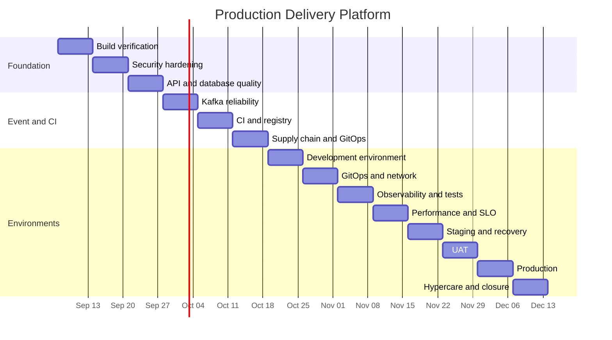

# One-week sprint plan

Planning baseline: 2026-09-04  
Sprint cadence: Monday through Sunday  
Target closure: 2026-12-13, subject to stage-gate evidence

The dates are planning targets, not promises. A failed gate moves unfinished work back to Ready or Backlog and updates the forecast.

## Release timeline

## Sprint schedule

| Sprint | Dates | Goal | Planned backlog | Exit evidence | Status |
| --- | --- | --- | --- | --- | --- |
| S01 | Sep 7–13 | Prove clean build and local runtime | PDP-010, 011, 030, 040 | Maven, smoke, Jenkins, Helm results | Planned |
| S02 | Sep 14–20 | Complete API security tests | PDP-012, 013, 014 | Negative auth and validation report | Planned |
| S03 | Sep 21–27 | Improve API and DB operational safety | PDP-015, 016 | Permission and error-contract tests | Planned |
| S04 | Sep 28–Oct 4 | Publish reliable order events | PDP-020, 021, 022 | Schema, outbox, Kafka evidence | Planned |
| S05 | Oct 5–11 | Complete consumers and image publishing | PDP-023, 024, 031, 032 | Replay test, registry digest, scans | Planned |
| S06 | Oct 12–18 | Secure the supply chain and automate GitOps update | PDP-033, 034, 035 | SBOM, signatures, GitOps bot commit | Planned |
| S07 | Oct 19–25 | Establish development Kubernetes environment | PDP-041, 042, 043, 050 | HTTPS API, Secret sync, Prometheus targets | Planned |
| S08 | Oct 26–Nov 1 | Enforce GitOps and network boundaries | PDP-044, 045, 046, 047, 060 | Policy tests, Argo health, drift recovery | Planned |
| S09 | Nov 2–8 | Add logs, dashboards, and security tests | PDP-051, 052, 053, 061 | Dashboard, correlated logs, test suite | Planned |
| S10 | Nov 9–15 | Prove performance, resilience, tracing, and alerts | PDP-054, 055, 062, 063 | Trace, SLO alert, load and resilience report | Planned |
| S11 | Nov 16–22 | Qualify staging and recovery | PDP-064, 065, 070 | Restore, rollback, staging approval | Planned |
| S12 | Nov 23–29 | Execute UAT | PDP-071, 072 | UAT pack and signed result | Planned |
| S13 | Nov 30–Dec 6 | Release to production | PDP-073, 074 | Go/no-go record and healthy release | Planned |
| S14 | Dec 7–13 | Stabilize, hand over, and close | PDP-075, 076 | Hypercare log and closure report | Planned |

## S01 detailed plan

### Sprint goal

Prove that the existing foundation builds, runs, and can be evaluated by Jenkins and Helm on a prepared Java 21 environment.

### Committed work

- [ ] PDP-010: clean Java 21 Maven build
- [ ] PDP-011: authenticated Compose smoke test
- [ ] PDP-030: Jenkins success and deliberate-failure evidence
- [ ] PDP-040: Helm lint and resource-count verification

### Acceptance evidence

- Tool version output
- Maven JUnit reports
- Smoke-test terminal result
- Jenkins build URL or exported result
- Helm lint and template result
- Full commit SHA

### Risks

- The current creation environment lacks Java 21, Maven, Docker, and Helm.
- Container image tags or local platform architecture may require adjustment.
- Keycloak or Kafka startup health may expose configuration defects.

### Scope rule

Do not add new business features during S01. Any discovered defect enters the sprint only when it blocks the goal; other improvements return to the backlog.

## Sprint rollover rule

At the end of each Sunday:

1. Mark only accepted items Done.
2. Return unfinished items to Ready or Backlog.
3. Record the reason for rollover.
4. Recalculate the release forecast.
5. Select the next sprint based on gates and dependencies.
6. Update `PROGRESS.md` and the GitHub sprint issue.
