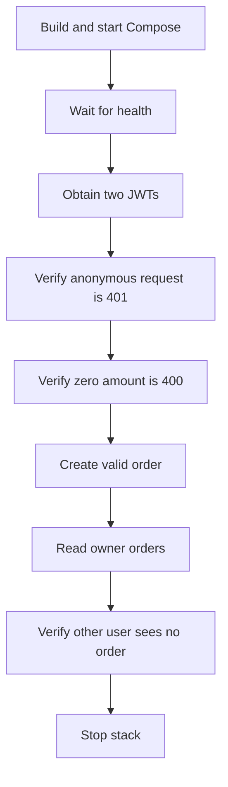

# Testing and evidence guide

## 1. Verification policy

No screenshot can prove that a distributed system is bug-free. Evidence must come from repeatable commands, test reports, deployment status, metrics, and recovery exercises. Screenshots are useful supporting evidence only when they show the exact command, commit, environment, and timestamp.

## 2. Test layers

| Layer | Current coverage | Command |
| --- | --- | --- |
| Static configuration | XML, YAML, JSON, shell syntax, Git whitespace | Creation workspace checks |
| Unit | Rate-limit key, JWT issuer/audience, order ownership, amount and currency validation | `mvn clean verify` |
| Local integration | Containers and dependency health | `docker compose up --build --wait` |
| API smoke | JWT, 401, 400, create/read, customer isolation | `./scripts/smoke-test.sh` |
| Helm | Lint, render, expected resource counts | `./scripts/verify.sh` |
| Kubernetes | Rollout, probes, HPA/PDB presence | Manual target-cluster checks |
| Security | Trivy critical image findings | Jenkins pipeline |
| Load and resilience | Not implemented | Required before production |

## 3. Run the standard verification

```bash
git status --short --branch
./scripts/verify.sh
./scripts/smoke-test.sh
```

Acceptance:

- The branch and commit are recorded.
- The working tree is clean.
- Both scripts exit with code `0`.
- No test is skipped to make the pipeline pass.

## 4. Unit tests

### Gateway tests

`RateLimitConfigTest` verifies:

- An authenticated principal becomes the Redis rate-limit key.
- An exchange without a principal uses the `anonymous` fallback.

### Order tests

`OrderControllerTest` verifies:

- Queries use the authenticated JWT subject.
- Created orders derive ownership from the JWT subject.
- Zero-value orders violate Bean Validation.

Add WebTestClient integration tests for full Spring Security filter behavior as the next test improvement.

## 5. Smoke-test behavior

The smoke test performs this sequence:



If the test fails, preserve logs before changing code:

```bash
docker compose ps
docker compose logs --no-color --tail=300 > smoke-failure.log
```

Inspect the log locally. Do not commit it because logs can contain identifiers and tokens.

## 6. Kubernetes verification

```bash
kubectl -n platform get deployment,pod,service,hpa,pdb
kubectl -n platform rollout status deployment/gateway-service --timeout=3m
kubectl -n platform rollout status deployment/order-service --timeout=3m
kubectl -n platform get events --sort-by=.lastTimestamp
kubectl -n platform top pods
```

Acceptance:

- Desired and ready replicas match.
- No containers are restarting.
- Readiness and liveness probes pass.
- CPU/memory usage is within configured limits.
- HPA reports valid metrics.
- PDB allows safe voluntary disruption.

## 7. Negative security tests

Automated coverage includes:

- Missing token
- Expired token
- Wrong issuer and missing API audience at the JWT validator
- Missing read scope
- Missing write scope
- Malformed JSON
- Zero and excessive amounts
- Negative and high-precision amounts
- Lowercase and unsupported currencies
- Runtime database identity cannot create schema objects
- Attempted cross-customer access

Still add a case for rate-limit exhaustion under controlled load.

## 8. Load test plan

Start with a controlled non-production environment:

1. Warm the service for five minutes.
2. Record a no-load baseline.
3. Increase virtual users gradually.
4. Measure P50/P95/P99 latency, error ratio, CPU, memory, database pool usage, and Redis latency.
5. Hold the expected peak load.
6. Push beyond peak to identify graceful degradation.
7. Stop and observe recovery.

Success criteria must be based on agreed SLOs rather than “the server did not crash.”

## 9. Resilience exercises

Perform and document:

- Kill one gateway pod during traffic.
- Kill one order-service pod during traffic.
- Restart Redis and observe gateway behavior.
- Interrupt PostgreSQL and verify clear failure signals.
- Deploy an invalid image tag and test rollback.
- Drain one Kubernetes node and verify the PDB and topology behavior.
- Pause Argo CD and confirm workloads continue while delivery stops.

## 10. Evidence format

Store non-sensitive evidence under a dated CI artifact or release record. Each evidence set should contain:

| Item | Required detail |
| --- | --- |
| Source | Repository, branch, full commit SHA |
| Environment | Local, development, staging, or production |
| Tool versions | Java, Maven, Docker, Helm, Kubernetes |
| Test report | JUnit XML and summary |
| Image | Repository tag and immutable digest |
| Deployment | Argo CD revision and Kubernetes rollout result |
| Observability | Target status and relevant dashboard snapshot |
| Recovery | Rollback command, duration, and result |

Never include passwords, access tokens, registry credentials, private URLs, or personal data in evidence screenshots.

## 11. Current verified status

Static format and archive checks passed in the creation environment. The creation environment did not include Java 21 build tools, Maven, Docker, or Helm, so it could not produce honest runtime-pass evidence. Run the repository scripts on a prepared Jenkins agent or workstation and attach those results before merging.
